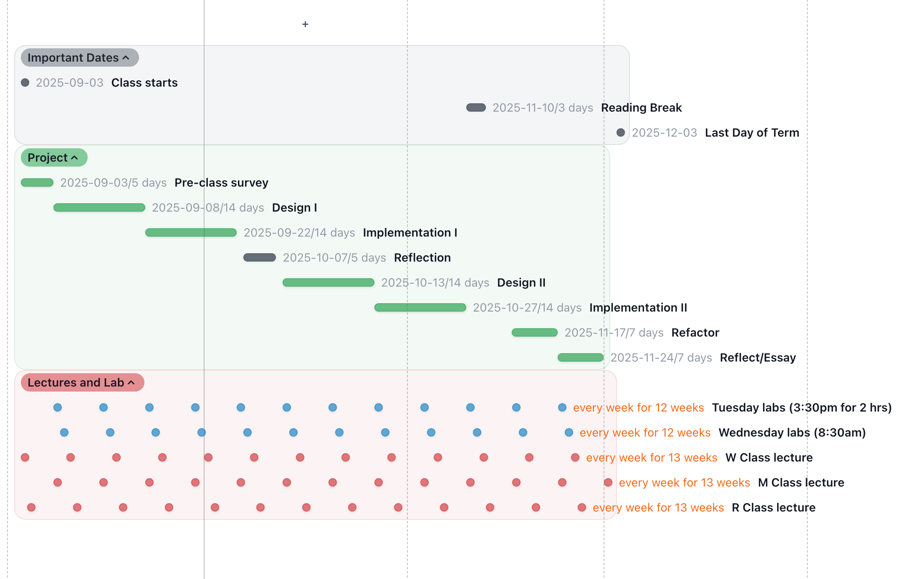

# ai-design-study

Study for SENG 350 in Fall 2025. This repository contains both the files that explain the design of the course and the planned research activities. 

# Useful links

- Overleaf: https://www.overleaf.com/3977853741skxbpbtrgghq#27c6ba
- Powerpoint slidedeck: https://uvic-my.sharepoint.com/:p:/g/personal/nathancassee_uvic_ca/EY0Al0JO5-JMjzM74PLM0YcBpcIlP2uvjxpCAS71078M_g?e=CbRdPH 
- Instruments: https://docs.google.com/document/d/1y0fA0GY_lHtgHrMHU1TPjSYgo7_AytqBMDCjXDjNUx4/edit?tab=t.0 

Student Project Plan: project-plan.md

Project Spec: project-spec.md

# Timeline

# Team
- @nathancassee
- @luizguerra
- @xueaoliu
- @nernst

