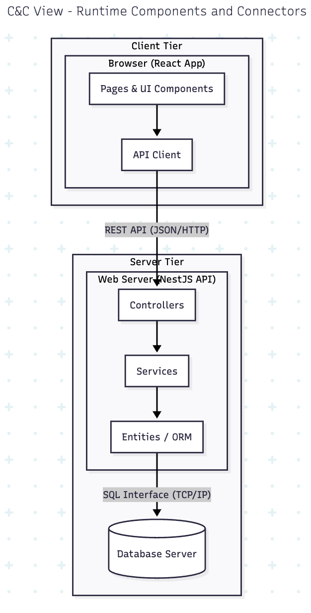
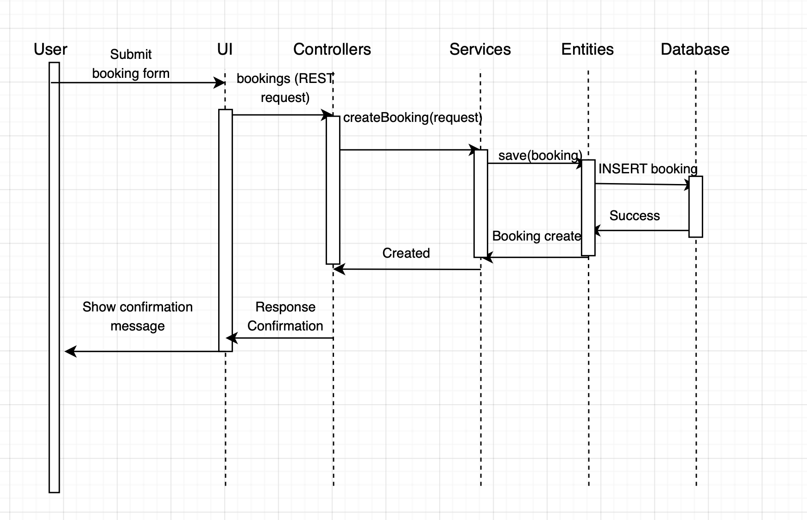

## C&C View

### 1. Primary Diagram

---

### 2. Element Catalog

| Element | Description |
| :--- | :--- |
| **Browser (React App)** | The client-side runtime process executing in the user's browser. It renders React `pages` (e.g., `ClassroomSearchPage.tsx`) and manages UI interactions. |
| **Client-Side State** | Runtime data held in the browser (e.g., in React state or context). Stores information like the current user's token and the search results. |
| **Web Server (NestJS API)** | The server-side runtime process. It listens for HTTP requests and orchestrates all backend logic by routing requests to the appropriate controllers. |
| **API Endpoints** | The "address book" of the API, defined in `controllers` (e.g., `bookings.controller.ts`). Routes like `POST /bookings` are data elements that the server uses to map requests. |
| **Business Logic Services** | The collection of running services (e.g., `bookings.service.ts`, `users.service.ts`) within the NestJS process that execute core application logic. |
| **Database Server (PostgreSQL)** | The external, persistent database process. It manages all data storage and retrieval, ensuring data integrity and handling concurrent access. |
| **Relational Data (Tables)** | The persistent data stored within the database, organized into tables like `users`, `rooms`, `bookings`, and `logs`. |

---

### 3. Interface Descriptions

| Interface (Connector) | From &rarr; To | Type | Description |
| :--- | :--- | :--- | :--- |
| **UI Interaction** | User &rarr; Browser | Events | The user provides input via `onClick`, `onChange`, etc. events. The React app listens for these events to update its state or trigger API calls. |
| **Internal State Access** | Browser &rarr; Client-Side State | Function Calls | The React components read from and write to their internal state/context to get authentication tokens or display data to the user. |
| **REST API** | Browser &rarr; Web Server | HTTP / JSON | The primary connector. The React app sends asynchronous HTTP requests (e.g., `POST /bookings`) with a JSON payload to the API Endpoints. |
| **Controller-Service Call** | Web Server &rarr; Business Logic | Internal Function Call | Within the NestJS process, the `controller` (e.g., `bookings.controller.ts`) calls a function on its injected `service` (e.g., `bookings.service.ts`) to execute the business logic. |
| **SQL Interface** | Business Logic &rarr; Database Server | SQL (via TCP/IP) | The `service` (via the ORM) sends SQL commands (e.g., `SELECT` for conflict checking, `INSERT` to save) over a TCP connection to the database. |

---

### 4. Rationale

This C&C view illustrates the classic client-server architecture, which provides a strong separation of concerns between presentation and business logic.

The **Client Tier (Browser)** is lightweight and focuses only on rendering the UI. It doesn't know or care how a booking is validated.

The **Server Tier** centralizes all business logic, validation, and data access. This ensures that:

- **Security:** The client cannot bypass validation rules or access the database directly.  
- **Integrity:** All booking logic (e.g., conflict checking) is handled in one place, ensuring no double bookings.  
- **Maintainability:** The frontend and backend teams can work independently, as long as they adhere to the REST API contract.

---

### 5. Behavior Sketch -- Sequence Diagram

#### Scenario: *User books a classroom*
