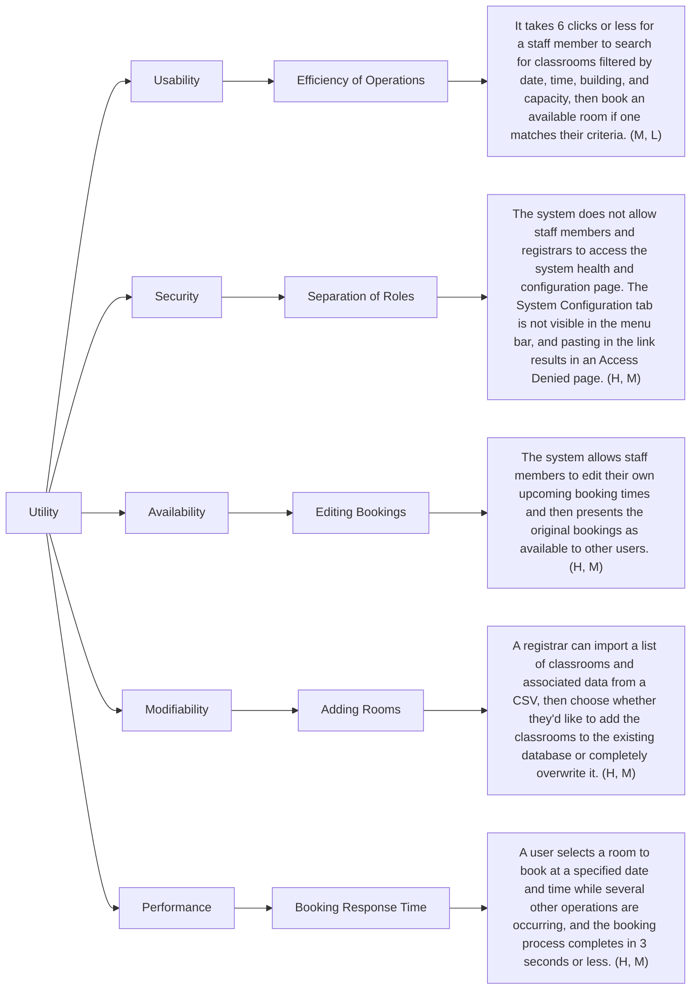

# Product Requirements Document

## Overview

The product is a web/mobile-web application that will modernize the classroom booking process at UVic. The application will help staff search for available classrooms based on a number of criteria, then make and/or cancel reservations on demand. The application will then prevent double bookings and provide clear failure messages when time conflicts arise.

Registrars, who oversee classroom availability and handle schedule integrity, will also have the ability to manage accounts and view analytics. Administrators will manage system configuration and can view detailed logs.

## Objectives & Goals

**1.** Provide a web/mobile-web application that streamlines UVic classroom scheduling, eliminating the need for manual intervention.

**2.** Authorize staff to search for, filter, book, and cancel classroom reservations.

**3.** Handle booking conflicts through concurrency control, ensuring only one successful booking per room and timeslot.

**4.** Provide tools for registrars to maintain classroom availability, handle schedule integrity, view logs and analytics, and block malicious accounts.

**5.** Enable admins to manage system configuration and audit logs without interfering in booking operations.

**6.** Deliver a portable and testable system with thorough documentation.

## User Stories
User stories are captured as the following Gitlab issues:

- https://gitlab.csc.uvic.ca/courses/2025091/SENG350_COSI/teams/group_10_proj/-/issues/1

- https://gitlab.csc.uvic.ca/courses/2025091/SENG350_COSI/teams/group_10_proj/-/issues/2

- https://gitlab.csc.uvic.ca/courses/2025091/SENG350_COSI/teams/group_10_proj/-/issues/3

- https://gitlab.csc.uvic.ca/courses/2025091/SENG350_COSI/teams/group_10_proj/-/issues/4

- https://gitlab.csc.uvic.ca/courses/2025091/SENG350_COSI/teams/group_10_proj/-/issues/19

- https://gitlab.csc.uvic.ca/courses/2025091/SENG350_COSI/teams/group_10_proj/-/issues/20

- https://gitlab.csc.uvic.ca/courses/2025091/SENG350_COSI/teams/group_10_proj/-/issues/21

- https://gitlab.csc.uvic.ca/courses/2025091/SENG350_COSI/teams/group_10_proj/-/issues/22

- https://gitlab.csc.uvic.ca/courses/2025091/SENG350_COSI/teams/group_10_proj/-/issues/23

- https://gitlab.csc.uvic.ca/courses/2025091/SENG350_COSI/teams/group_10_proj/-/issues/24

- https://gitlab.csc.uvic.ca/courses/2025091/SENG350_COSI/teams/group_10_proj/-/issues/25

- https://gitlab.csc.uvic.ca/courses/2025091/SENG350_COSI/teams/group_10_proj/-/issues/26

- https://gitlab.csc.uvic.ca/courses/2025091/SENG350_COSI/teams/group_10_proj/-/issues/27

## Functional Requirements
Functional requirements are captured as the following Gitlab issues:  

- https://gitlab.csc.uvic.ca/courses/2025091/SENG350_COSI/teams/group_10_proj/-/issues/28

- https://gitlab.csc.uvic.ca/courses/2025091/SENG350_COSI/teams/group_10_proj/-/issues/29

- https://gitlab.csc.uvic.ca/courses/2025091/SENG350_COSI/teams/group_10_proj/-/issues/30

- https://gitlab.csc.uvic.ca/courses/2025091/SENG350_COSI/teams/group_10_proj/-/issues/31

- https://gitlab.csc.uvic.ca/courses/2025091/SENG350_COSI/teams/group_10_proj/-/issues/32

- https://gitlab.csc.uvic.ca/courses/2025091/SENG350_COSI/teams/group_10_proj/-/issues/33

- https://gitlab.csc.uvic.ca/courses/2025091/SENG350_COSI/teams/group_10_proj/-/issues/34

- https://gitlab.csc.uvic.ca/courses/2025091/SENG350_COSI/teams/group_10_proj/-/issues/35

- https://gitlab.csc.uvic.ca/courses/2025091/SENG350_COSI/teams/group_10_proj/-/issues/36

- https://gitlab.csc.uvic.ca/courses/2025091/SENG350_COSI/teams/group_10_proj/-/issues/37

- https://gitlab.csc.uvic.ca/courses/2025091/SENG350_COSI/teams/group_10_proj/-/issues/38

- https://gitlab.csc.uvic.ca/courses/2025091/SENG350_COSI/teams/group_10_proj/-/issues/39

- https://gitlab.csc.uvic.ca/courses/2025091/SENG350_COSI/teams/group_10_proj/-/issues/40

- https://gitlab.csc.uvic.ca/courses/2025091/SENG350_COSI/teams/group_10_proj/-/issues/41

- https://gitlab.csc.uvic.ca/courses/2025091/SENG350_COSI/teams/group_10_proj/-/issues/42

- https://gitlab.csc.uvic.ca/courses/2025091/SENG350_COSI/teams/group_10_proj/-/issues/43

- https://gitlab.csc.uvic.ca/courses/2025091/SENG350_COSI/teams/group_10_proj/-/issues/44

- https://gitlab.csc.uvic.ca/courses/2025091/SENG350_COSI/teams/group_10_proj/-/issues/45

- https://gitlab.csc.uvic.ca/courses/2025091/SENG350_COSI/teams/group_10_proj/-/issues/46

- https://gitlab.csc.uvic.ca/courses/2025091/SENG350_COSI/teams/group_10_proj/-/issues/47

## Quality Attribute Requirements
Quality attribute requirements and scenarios are captured as the following Gitlab issues:  

- https://gitlab.csc.uvic.ca/courses/2025091/SENG350_COSI/teams/group_10_proj/-/issues/48

- https://gitlab.csc.uvic.ca/courses/2025091/SENG350_COSI/teams/group_10_proj/-/issues/49

- https://gitlab.csc.uvic.ca/courses/2025091/SENG350_COSI/teams/group_10_proj/-/issues/50

- https://gitlab.csc.uvic.ca/courses/2025091/SENG350_COSI/teams/group_10_proj/-/issues/51

- https://gitlab.csc.uvic.ca/courses/2025091/SENG350_COSI/teams/group_10_proj/-/issues/52

They are also presented as the following utility tree:  

## Milestones & Deliverables
The user stories captured as Gitlab issues have associated due dates. See the issue descriptions.