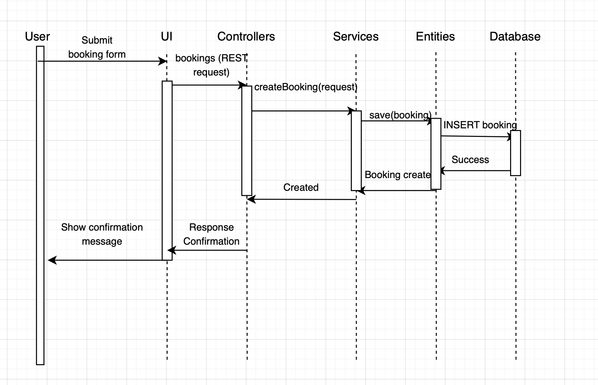

## Module View

### 1. Primary Diagram

---

### 2. Element Catalog

| **Element**               | **Description**                                                                                       |
|----------------------------|---------------------------------------------------------------------------------------------------------|
| **Frontend (React)**       | Presentation layer containing UI pages and components. Handles user interactions and sends API requests to the backend. |
| **Backend (NestJS)**       | Application layer that processes incoming requests, applies business logic, and interacts with the database. |
| **Controllers**            | Handle API requests from the frontend and map them to corresponding service functions.                 |
| **Services**               | Contain core business logic, validation, and coordination between controllers and data entities.       |
| **Entities**               | Define the data models and interact with the database through the ORM.                                 |
| **Core / Bootstrap**       | Initializes and configures the application (e.g., `app.module.ts`, `main.ts`).                         |
| **PostgreSQL Database**    | Relational data storage layer. Stores persistent data for bookings, rooms, users, and logs.            |

---

### 3. Interface Descriptions

| **Interface**                        | **From → To**               | **Type**                  | **Description**                                                                 |
|---------------------------------------|-----------------------------|----------------------------|----------------------------------------------------------------------------------|
| UI Rendering                          | Frontend                    | Internal                  | UI components interact internally to render pages and manage state.             |
| REST API                              | Frontend → Backend          | HTTP / JSON               | Frontend sends REST API requests (e.g., GET/POST bookings, rooms, users).       |
| Controller–Service                    | Controllers → Services      | Function calls            | Controllers delegate requests to services for business logic execution.        |
| Service–Entity                        | Services → Entities         | ORM calls / function calls| Services interact with entities to query or update the database.               |
| Database Access                       | Backend → Database          | SQL (via ORM)             | Backend persists and retrieves data using PostgreSQL.                           |

---

### 4. Rationale

> The system uses a **layered architecture** to separate concerns and improve maintainability.  
> 
> - The **presentation layer** is built with React to provide a responsive and modular user interface.  
> - The **application layer** (NestJS) is structured around controllers, services, and entities to support clean separation between API handling, business logic, and data access.  
> - The **data layer** uses PostgreSQL to ensure reliable and scalable persistence.  

---

### 5. Behavior Sketch -- Sequence Diagram

#### Scenario: *User books a classroom*
